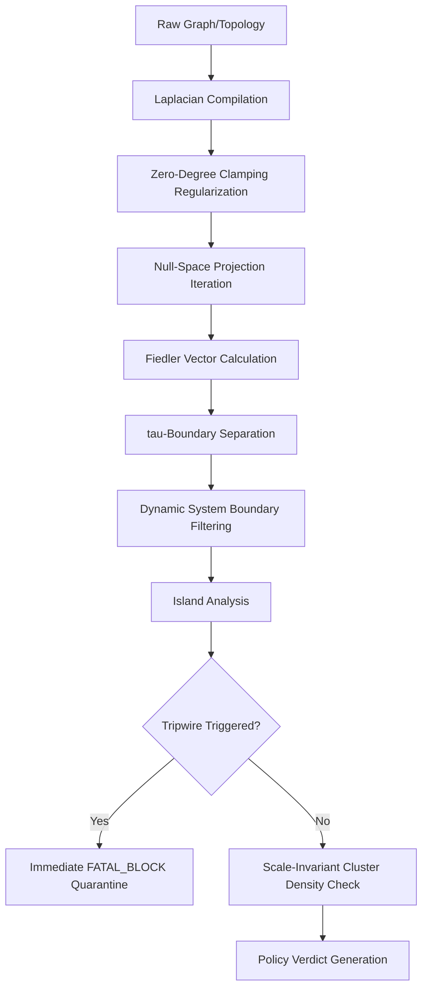

# 🛠️ Tau-Spectral Pruner (TSP) — Developer & DX Manifesto

Welcome to the `spectral-pruner` Developer Guide. This document is designed for systems engineers, security researchers, and mathematical contributors looking to **utilize** the framework inside high-throughput runtimes or **extend** the underlying spectral engines for custom security audits.

> [!NOTE]
> For consumer installation, quickstart examples, mathematical theory breakdowns, and practical showcases, please refer to the primary [README.md](README.md).

---

## 🧭 I. Architecture & Codebase Map

The codebase is built for extreme efficiency and mathematical clarity. Here is the layout of the core components:

```text
spectral-pruner/
├── AGENTS.md            # Manifest file guiding developer AI agents on core invariants.
├── Cargo.toml           # Package metadata, targeting zero external dependencies.
├── DEVELOPMENT.md       # This document (DX, integration, and extension specs).
├── README.md            # Consumer quickstart, mathematical theory, and visual examples.
├── examples/            # High-fidelity system integrations (LLM, DeFi, ZK, Service Mesh, etc.)
└── src/
    ├── lib.rs           # Crate entry point, exposing core types and builder structures.
    └── engine.rs        # Core math engine (shifted Laplacian power iteration, clamping, metrics).
```

### Core Pipeline Lifecycle
When `TauSpectralPruner::prune` is executed, the following high-level sequence occurs:



---

## ⚡ II. Utilizing the Crate (Integration Patterns)

For general utilization, you will construct a `Topology` and configure a `TauSpectralPruner` instance.

### 1. Programmatic Graph Construction
A topology represents a causal relational graph. The library uses 0-indexed nodes:

```rust
use spectral_pruner::{Topology, TauSpectralPruner, PolicyAction};

fn run_audit() -> Result<(), spectral_pruner::PrunerError> {
    // 1. Initialize a topology of 8 nodes
    let mut topology = Topology::new(8);
    
    // 2. Establish dense mainland communication (Nodes 0, 1, 2, 3)
    topology.add_edge(0, 1);
    topology.add_edge(1, 2);
    topology.add_edge(2, 3);
    topology.add_edge(3, 0);

    // 3. Establish an anomalous decoupled island (Node 4) communicating with system space (Node 7)
    topology.add_edge(4, 7);
    
    // 4. Mark nodes 6 and 7 as system boundary nodes (e.g. databases, outbound network sockets)
    topology.add_sink(6);
    topology.add_sink(7);

    // 5. Build the pruner
    let pruner = TauSpectralPruner::builder()
        .tau(0.0)                  // Numerical bisection partition boundary
        .threat_threshold(1.5)     // Sensitivity density ratio limit
        .system_start_idx(6)       // Tell the engine system boundaries start at Node 6
        .build();

    // 6. Audit up to node 7 (length of system context space = 8)
    let resolution = pruner.prune(&topology, 8)?;

    match resolution.action {
        PolicyAction::FatalBlock => {
            println!("🚨 Quarantined suspicious entities: {:?}", resolution.island_nodes);
        }
        PolicyAction::Allow => {
            println!("✅ Graph structural integrity verified.");
        }
    }
    Ok(())
}
```

### 2. Inspecting Spectral Diagnostics
For auditing, logging, or debugging, the `PrunerResolution` exposes granular mathematical metrics:

* `resolution.lambda2`: The second-smallest eigenvalue of the Laplacian (algebraic connectivity). A value of $0.0$ or near-zero indicates that the graph is disconnected (multiple components exist).
* `resolution.island_nodes`: A `Vec<usize>` representing the isolated component nodes.
* `resolution.mainland_nodes`: A `Vec<usize>` representing the stable mainland context.
* `resolution.fiedler_vector`: The full computed Fiedler eigenvector of the graph, showing exactly where every node falls relative to the division.

---

## 🛠️ III. Extending the Mathematical Engine

The core design allows for flexible modifications. The following sections detail how to extend the calculations in [src/engine.rs](file:///Volumes/Storage/bigworkspace/spectral-pruner/src/engine.rs).

### 1. Custom Laplacian Regularization (Isolated Node Handling)
By default, the library stabilizes disconnected (degree == 0) nodes using **Zero-Degree Clamping Regularization**:
$$v_i = 1.0$$
This forces isolated chaff to join the mainland predictably rather than staying stuck in random initialization noise.

To extend or modify this regularization, open [src/engine.rs](file:///Volumes/Storage/bigworkspace/spectral-pruner/src/engine.rs) and locate the initial Fiedler vector assignment phase inside `prune`. 

```rust
// In src/engine.rs:
// Swap this block if you want to implement custom initialization regularizations
for i in 0..n {
    if degrees[i] == 0.0 {
        v_vec[i] = 1.0; // Standard Zero-Degree Clamping Regularization
    } else {
        v_vec[i] = (i as f64).sin();
    }
}
```

### 2. Modifying the Volume-Agnostic Density Metric
The threat metric determines if an isolated island is an active exploit or benign chaff. The **Scale-Invariant Cluster Density Ratio** is calculated as:
$$\text{Ratio} = \frac{\text{Internal Edges} \times N_{\text{system}}}{\text{System Edges} \times N_{\text{island}}}$$

To add customized weightings (for example, applying quadratic decay on system edges to penalize massive bridges), edit the metric evaluation block:

```rust
// In src/engine.rs:
let normalized_ratio = if to_system_edges > 0.0 {
    // Standard scale-invariant calculation:
    (island_internal_edges * system_boundary_len as f64) 
        / (to_system_edges * island_len as f64)
} else {
    0.0
};
```
If you wish to create a custom ratio that penalizes bridges heavily, you can adjust the denominator to scale non-linearly.

### 3. Creating Custom Security Tripwires
The **Micro-Steering Single-Token Tripwire** immediately quarantines islands matching:
$$N_{\text{island}} == 1 \land \text{Internal Edges} == 0 \land 0.0 < \text{System Edges} < 2.0$$

To add an additional custom tripwire (e.g., catching multi-node linear chains or circular paths with zero external links), insert a new check into the evaluation sequence in [src/engine.rs](file:///Volumes/Storage/bigworkspace/spectral-pruner/src/engine.rs):

```rust
// Example: Custom Multi-Node Circular Loop Tripwire
let is_circular_tripwire = island_len == 3 
    && island_internal_edges >= 3.0 
    && to_system_edges == 0.0;

if is_circular_tripwire {
    action = PolicyAction::FatalBlock;
}
```

---

## 🔬 IV. Developer Experience (DX) Commands

A seamless DX ensures rapid cycles and prevents mathematical regressions. The following standard tools are available out-of-the-box:

### 1. Build and Zero-Dependency Validation
Ensure the crate compiles cleanly under standard Rust tooling:
```bash
cargo build
```

### 2. Running the Test Suite
The crate maintains a high-coverage unit testing suite validating bisections, boundaries, and regularizations:
```bash
cargo test
```

### 3. Running Pre-bundled Production Showcases
Execute the highly descriptive integration scripts in the `/examples` directory:
```bash
# Audit an LLM Prompt's self-attention matrix with a visual matrix heatmap
cargo run --example llm_steerage_guard

# Audit ZK-SNARK R1CS signal flows for constraints loopholes
cargo run --example zk_circuit_backdoor

# Audit DeFi mempools for flashloan sandwich loops
cargo run --example defi_mempool_mev

# Audit Kubernetes service mesh lateral communication links
cargo run --example service_mesh_audit
```

### 4. Code Formatting and Lint Compliance
To merge code back upstream, your changes must be clean of lint warnings and conform to standard formatting conventions:
```bash
cargo fmt --check
cargo clippy --all-targets -- -D warnings
```

---

## 🚫 V. Hard Structural Invariants

If you are developing patches or contributing upstream, you must preserve these three absolute invariants. Violating them will trigger a structural regression:

1. **Absolute Zero Dependencies**: Never add any crates to `Cargo.toml`. Math must be written natively.
2. **Pre-allocated Vector Buffers**: To maintain $O(1)$ loop allocations and prevent heap thrashing, do not use `Vec::new()`, `vec![]`, or `.collect()` inside the power iteration loop. Reuse the pre-allocated working buffers `v_m` and `v_next` in-place.
3. **Inclusive System Processing**: All boundary nodes must remain active in the graph during math computations (Laplacian, Power Iteration, Fiedler Vector). They must **only** be filtered out from the final returned vectors right before returning the `PrunerResolution` payload to preserve algebraic context.
